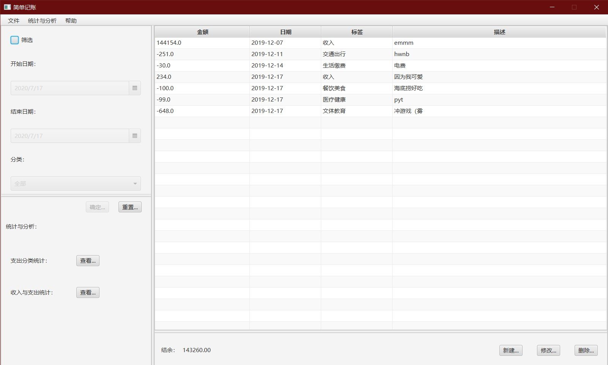
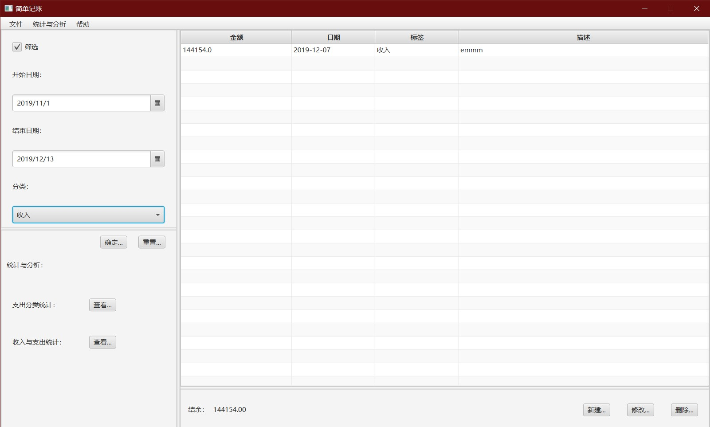
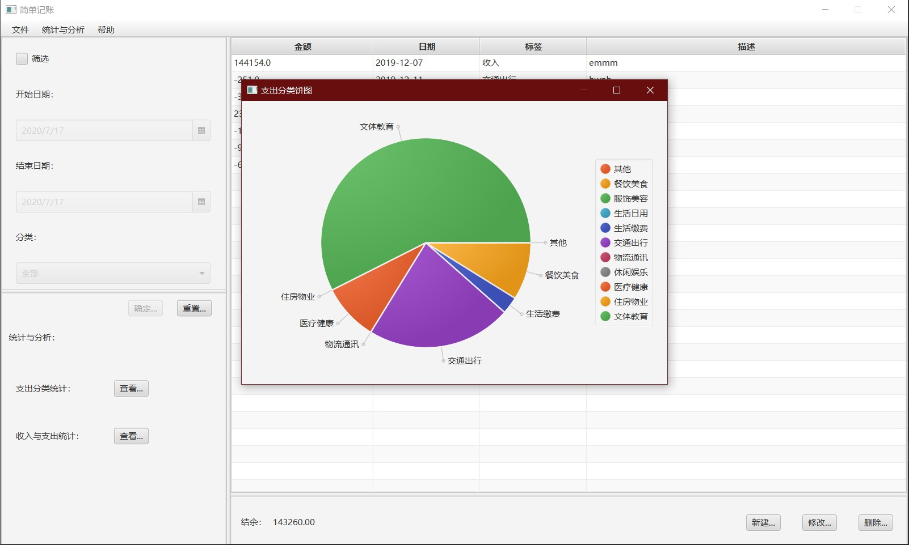

# SimpleBookKeeper
A simple bookkeeper using javaFX.

# Supported features

- Bookkeeping
  
- Filter
  
- Statistics
  
- Exporting .xlsx file

# Run and Develop
You need Java13 and JavaFX 13 to run this project. Maybe you need a little time to config the ide for this environment.
Use `gradle run` to test this app.
Use `gradle jlink zip` to generate production zip.